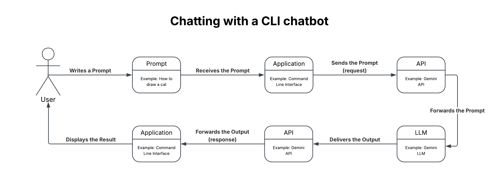

# The AI Development Toolchain

## What is the AI Development Toolchain?

It is an integrated set of software, APIs, and libraries designed to integrate together to make an AI powered application.

## The tools

### API (Application Programming Interface)

An API is an interface that handles requests and provides responses to a client, but it doesn't do the actual heavy work of the request. The API when given a request, forwards it to an Application that the client usually does not have direct access to. It then waits for the Application's response so it could respond to the request it got.

Think of the API as a restaurant waiter, and client as a customer (the person who sends the request), and the Application as the Chef.

### CLI (Command Line Interface)

A CLI is a text based interface that allows you to manage your system without relying on a GUI. It can also be used to run many applications, such as AI applications like Claude Code.

### IDE (Integrated Development Environment)

The IDE is a workspace environment for developers. It makes managing project files much easier by combining a code editor, a compiler, and a debugger all in a single GUI (Graphical User Interface). Some IDEs also allow you to install plugins for different other software, such as Docker, LLM API, and Database plugins.

## The diagram

This diagram shows how [Task1.py](../Day2/Task1.py) in Day2 works under the hood.

