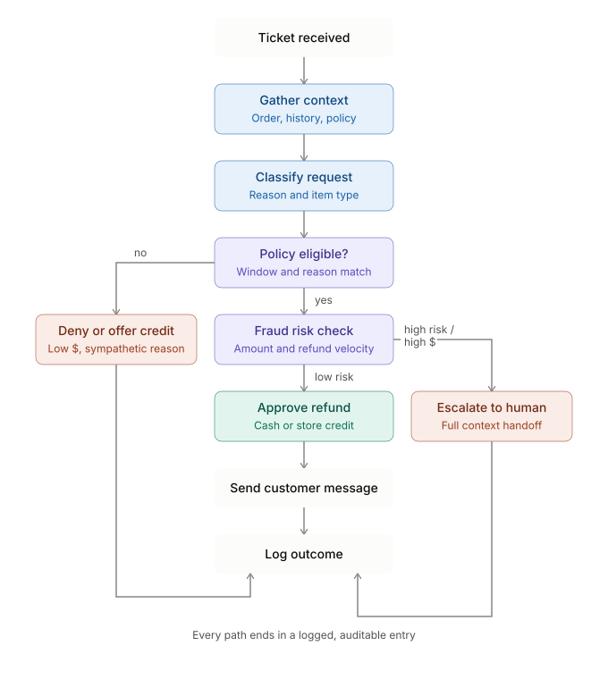

# Refund Triage Agent — Design Document

## Goal

Given an incoming customer support ticket requesting a refund or return, the agent resolves straightforward cases automatically — approve, deny, or offer a store-credit alternative — within company policy. Ambiguous, high-value, or high-risk cases are escalated to a human agent.

The agent optimizes for two things at once:
- **Minimize wrongful denials** — don't punish legitimate customers with slow or unfair resolutions.
- **Minimize wrongful approvals** — don't let refund abuse or fraud drain revenue.

## Inputs

| Input | Description |
|---|---|
| Ticket text | The customer's message: stated reason, tone, urgency |
| Order ID / customer ID | Identifiers used to pull records |
| Attached evidence | Photos of damage, screenshots, order confirmations |
| Implicit signals | Account age, order history, prior refund count (pulled via tools, not given directly) |

## Tools available

| Tool | Purpose | Risk level |
|---|---|---|
| `get_order_details(order_id)` | Items, price, order/delivery dates, shipping status | Read-only |
| `get_customer_history(customer_id)` | Past orders, past refunds, account age, flags | Read-only |
| `check_policy(item_category, days_since_delivery)` | Eligibility window and rules for that item type | Read-only |
| `check_fraud_signals(customer_id, order_id)` | Velocity checks, chargeback history, refund-abuse score | Read-only |
| `issue_refund(order_id, amount, method)` | Executes a refund — moves real money | **Irreversible** |
| `issue_store_credit(customer_id, amount)` | Lower-risk alternative to a cash refund | Reversible-ish |
| `send_customer_message(ticket_id, message)` | Replies to the customer | Low risk |
| `escalate_to_human(ticket_id, reason, summary)` | Hands off the case with full context | Low risk |

Read-only tools are called freely and in parallel. Tools that move money or make a final commitment are gated by policy checks and dollar thresholds.

## Outputs

For every ticket, the agent produces:
1. **A resolution**: approve refund, approve store credit, deny with explanation, or escalate.
2. **A customer-facing message** — empathetic, plain-language, grounded in policy (not "per section 4.2 of our terms").
3. **An internal log entry** — what tools were called, what the reasoning was, and a confidence level. This is what makes the agent auditable.

## Decision process

1. **Gather context** — call `get_order_details`, `get_customer_history`, and `check_policy` in parallel. These are read-only, so no human confirmation is needed before calling them.
2. **Classify the request** — defective item, wrong item, changed mind, item never arrived, etc. This determines which policy branch applies.
3. **Check eligibility** — is the request within the return window, and does the reason match a policy-covered reason?
4. **Run a fraud check** — triggered if the refund amount exceeds a set threshold, or the customer has more than 2 refunds in the last 90 days.
5. **Decide**:
 - **Policy-eligible + low fraud risk + amount under the auto-approval limit** → call `issue_refund` or `issue_store_credit`, then `send_customer_message`.
 - **Policy says no, but the reason is sympathetic and the amount is low** (e.g. a $12 item) → offer store credit as goodwill instead of a flat denial.
 - **Any of**: high dollar amount, fraud signals present, contradictory evidence, an upset or chargeback-threatening customer, or a genuinely ambiguous policy read → call `escalate_to_human` with a full summary. The agent does not guess on these.
6. **Hard circuit breaker** — the agent never auto-executes an irreversible refund above a fixed dollar cap, regardless of how confident it is. This is a designed-in limit, not a per-ticket judgment call.
7. **Log everything** — every auto-resolved ticket is logged with its reasoning, so humans can audit a sample weekly and catch policy drift or agent errors before they compound.

## Why this shape generalizes

The core pattern here — **read-only tools called freely, action tools gated by confidence and dollar thresholds, and an explicit escalation path with a paper trail** — is a reusable template for any agent that takes real-world actions with consequences (placing purchase orders, sending contracts, modifying infrastructure, etc.). The specifics change; the shape of the safety rails doesn't.

## The diagram

